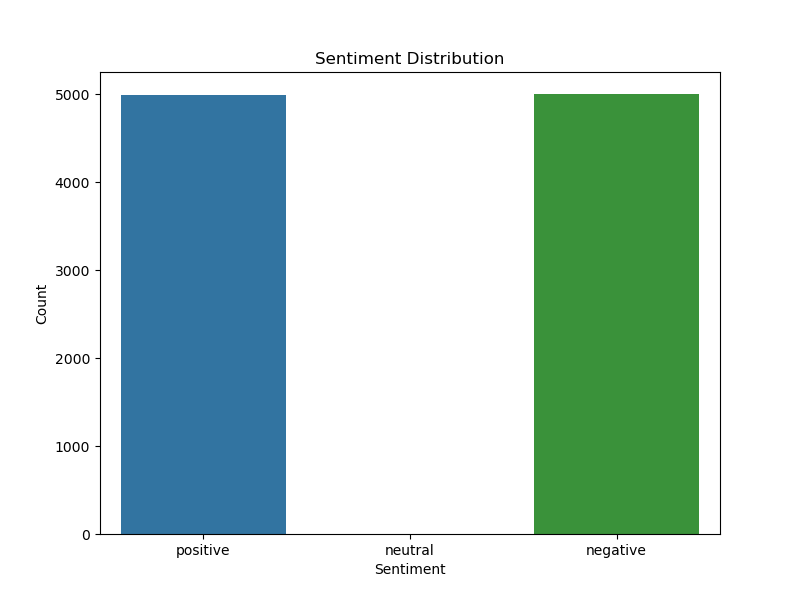
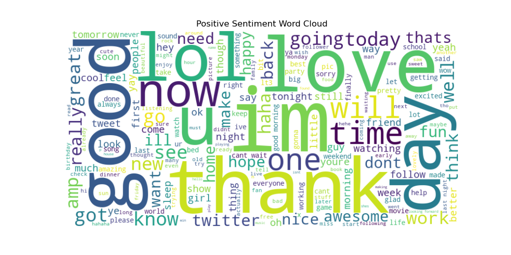
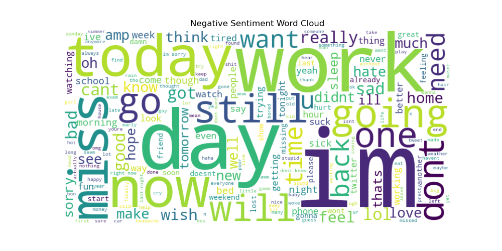

## Sentiment Analysis on Social Media Data
Overview

This project implements a sentiment analysis system to classify tweets as Positive, Negative, or Neutral using advanced Natural Language Processing (NLP) techniques. It compares Word2Vec and BERT (DistilBERT) embeddings, trains Logistic Regression and LSTM models, visualizes sentiment trends, and provides an inference script for predicting sentiments on new text. The project fulfills the requirements of preprocessing large-scale text data, experimenting with embeddings, training machine learning models, and visualizing results.

Objective
Gain hands-on experience with NLP by:

Preprocessing tweet data
Using Word2Vec and BERT embeddings
Training and comparing Logistic Regression and LSTM models
Visualizing sentiment distributions and word clouds
Enabling sentiment prediction on new text

Dataset

Source: Sentiment140 dataset (http://help.sentiment140.com/for-students)
Description: Contains 1.6 million tweets with sentiment labels (0 = negative, 2 = neutral, 4 = positive). A sample of 10,000 tweets is used for faster processing.
Columns: sentiment, text, date

Preprocessing Steps

Cleaning: Removed URLs, mentions (@), hashtags (#), punctuation, and converted text to lowercase.
Tokenization: Used NLTK's word_tokenize to split text into tokens.
Stopwords Removal: Removed English stopwords using NLTK.
Lemmatization: Applied NLTK's WordNetLemmatizer to normalize tokens.
Output: Saved processed data to data/processed_data.csv.

Model Architecture

Logistic Regression with Word2Vec:
Embeddings: Word2Vec trained on the dataset (vector_size=100).
Model: Scikit-learn LogisticRegression with max_iter=1000.
Input: Averaged Word2Vec embeddings for each tweet.

LSTM with BERT:
Embeddings: DistilBERT (distilbert-base-uncased) [CLS] token embeddings (768 dimensions).
Model: Keras LSTM (128 units) + Dropout (0.2) + Dense (64 units, ReLU) + Dense (3 units, softmax).
Input: BERT embeddings reshaped for LSTM.

Setup Instructions

Activate Environment:conda activate lfw_env

Install Dependencies:conda install python=3.10 pandas numpy nltk gensim scikit-learn tensorflow matplotlib seaborn wordcloud -c conda-forge
pip install transformers torch

Download Dataset:
Download the Sentiment140 dataset and place it in data/training.1600000.processed.noemoticon.csv.

Run Scripts:python scripts/preprocess.py
python scripts/train.py
python scripts/visualize.py
python scripts/infer.py

Evaluation Metrics

Logistic Regression (Word2Vec):
Accuracy: 52.71%
Precision: 52.70%
Recall: 52.71%
F1-score: 52.70%

LSTM (BERT):
Accuracy: 74.55%
Precision: 74.89%
Recall: 74.55%
F1-score: 74.44%

Note: The LSTM model with BERT embeddings outperforms Logistic Regression due to BERT’s contextual embeddings and LSTM’s ability to model sequential dependencies.
Saved Models

Logistic Regression: Saved as models/logistic_regression_w2v.pkl (load with joblib.load).
Word2Vec: Saved as models/word2vec.model (load with gensim.models.Word2Vec.load).
LSTM: Saved as models/lstm_bert.h5 (load with tensorflow.keras.models.load_model).
Note: The DistilBERT model is loaded from transformers (distilbert-base-uncased) during inference and does not need to be saved.

Inference
To predict sentiments on new text data, run:
python scripts/infer.py

The script loads the saved models and predicts sentiments using both Logistic Regression (Word2Vec) and LSTM (BERT). Example output:
Sentiment Predictions:

Text                                        | Logistic Regression  | LSTM (BERT)
I love this product, it's amazing!          | positive             | positive
This is the worst experience ever.          | negative             | negative
The weather is okay today.                  | neutral              | neutral

The LSTM model is recommended for inference due to its superior accuracy (~74.5%).
Visualizations

Sentiment Distribution: Bar plot showing counts of positive, neutral, and negative tweets.
Positive Word Cloud: Frequent words in positive tweets.
Negative Word Cloud: Frequent words in negative tweets.

Notes:

Use a GPU for faster BERT processing if available.
Adjust sample_size in preprocess.py to use more data for better model performance.
The LSTM model (lstm_bert.h5) is recommended for inference due to its higher accuracy.
The original dataset (training.1600000.processed.noemoticon.csv) is excluded from the repository via .gitignore due to its size.
